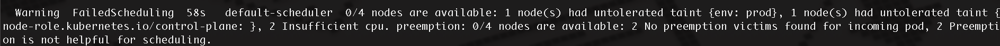

# Kubernetes Resource Limits Example

## Overview
In this task, we demonstrate how to limit the resources of a pod using **resource limits** in Kubernetes. We intentionally set resource limits lower than the actual resource usage to observe the behavior when these limits are exceeded.

## Task Details
- Each node in the cluster has **2 CPUs** and **4 Gi memory**.
- We create two deployments:
  1. **ex-cpu**: High CPU utilization.
  2. **ex-memory**: High memory utilization.

### Deployment Configurations

#### Deployment: ex-cpu
- Pod resource limit: **2 CPUs**, **3 Gi memory**.
- Actual pod request: **3 CPUs**, **5 Gi memory**.
- Expected outcome: CPU limit exceeded, leading to errors.
- Error Reference: `cpu.png`

#### Deployment: ex-memory
- Pod resource limit: **0.5 CPUs**, **1 Gi memory**.
- Actual pod request: **1 CPU**, **2 Gi memory**.
- Expected outcome: Memory limit exceeded, leading to errors.
- Error Reference: `memory.png`

## Deployment Files
Below is the YAML configuration for the deployments:

### ex-cpu Deployment
```yaml
apiVersion: apps/v1
kind: Deployment
metadata:
  name: ex-cpu
spec:
  replicas: 1
  selector:
    matchLabels:
      app: ex-cpu
  template:
    metadata:
      labels:
        app: ex-cpu
    spec:
      containers:
      - name: ex-cpu
        image: polinux/stress
        resources:
          limits:
            cpu: "2"
            memory: "3Gi"
```

### ex-memory Deployment
```yaml
apiVersion: apps/v1
kind: Deployment
metadata:
  name: ex-memory
spec:
  replicas: 1
  selector:
    matchLabels:
      app: ex-memory
  template:
    metadata:
      labels:
        app: ex-memory
    spec:
      containers:
      - name: ex-memory
        image: polinux/stress
        resources:
          limits:
            cpu: "0.5"
            memory: "1Gi"
```

## Steps to Run
1. Apply the YAML files to create the deployments:
   ```bash
   kubectl apply -f ex-cpu.yml
   kubectl apply -f ex-memory.yml
   ```

2. Check the pods and monitor their status:
   ```bash
   kubectl get pods -o wide
   ```

3. Observe errors when resource limits are exceeded:
   - High CPU usage error: Refer to `cpu.png`.
   - High Memory usage error: Refer to `memory.png`.

4. Check logs for details about resource limits being hit:
   ```bash
   kubectl logs <pod-name>
   ```

## Screenshots
- **CPU Error**:  
  
- **Memory Error**:  
  
